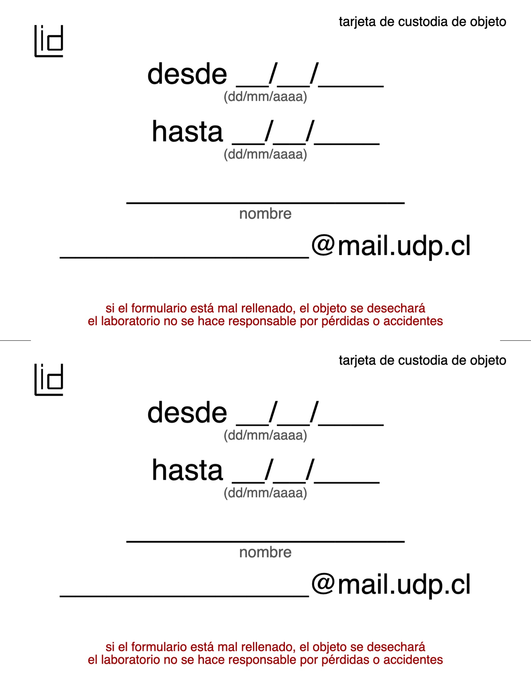

---js
const eleventyNavigation = {
 key: "Investigación",
 order: 4
}
---

# Investigación

## Diseño paramétrico de instrumentos 3D

En conjunto con el laboratorio de Lutheria Postidigital de la Universidad de Chile, estamos desarrollando un proyecto de investigación sobre diseño paramétrico de instrumentos 3D, en particular de instrumentos de cuerda latinoamericanos, con fines educacionales y de acceso.

## Web abierta del laboratorio

* Personas:
  * Aarón Montoya: investigación sobre herramientas de diseño paramétrico y automatización de procesos.
* Herramientas:
  * Eleventy <https://www.11ty.dev/>
* Proceso:
  * <https://github.com/disenoUDP/laboratorioInteraccionDigital>: sitio web del laboratorio hecho con Eleventy.

En el laboratorio estamos usando las siguientes herramientas para la generación de sitios web, tutoriales, documentación y .

Este trabajo se realiza de fuente abierta y disponible para cualquier otra comunidad que quiera adaptarlo.

Estos esfuerzos se encuentran en los siguientes repositorios:

## Gráficas paramétricas para identidad gráfica del laboratorio

* Personas:
  * Aarón Montoya: investigación sobre herramientas de diseño paramétrico y automatización de procesos.
  * Mateo Arce: decisiones de estilo gráfico e implementación
* Herramientas:
  * Mechanic: herramienta de diseño paramétrico para la web.
* Proceso:
  * <https://github.com/disenoUDP/lid-graficas>: gráficas del laboratorio hechas con Mechanic.

