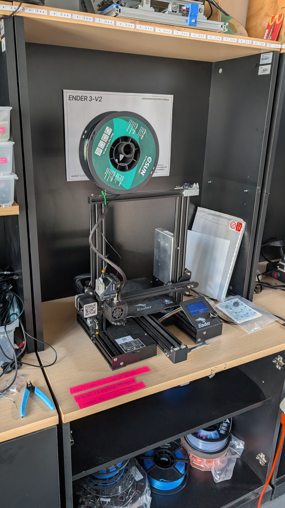
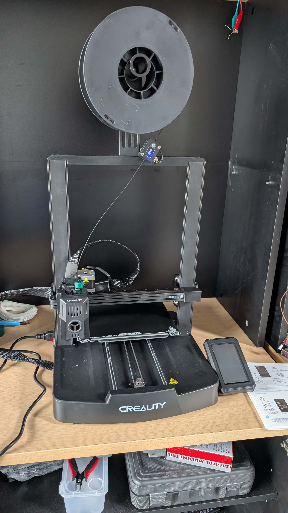

---js
const eleventyNavigation = {
 key: "Biblioteca",
 order: 7
}
---

# Biblioteca

Secciones:

- <#cuerdas>
- <#sintetizadores>

## Cuerdas

### Ciat-Lonbarde Shtar

Tar

### Yamaha RBX370-a

Bajo eléctrico

### Ibanez Omar Rodriguez Lopez

Guitarra eléctrica

### Ibanez Jetking-2

### G&L F-100

Guitarra eléctrica

### Sintetizadores

## Creality Ender-2 V2

- Máquina donada al lab.
- Materiales usados: TPU
- Coordinar uso vía Discord del lab con la gente ahí indicada.

## Creality Ender-3 V3 KE

- Máquina propiedad de profesore Aarón Montoya.
- Materiales usados: PLA.
- Coordinar vía Discord del lab con la gente ahí indicada, y además reservar en el calendario.

<!-- Google Calendar Appointment Scheduling begin -->
<iframe src="https://calendar.google.com/calendar/appointments/schedules/AcZssZ0tTHRJLcyj7voC4ob1S8Q7eSxw7exRavLQ8miSsNqB-3efHxNCyeLvcYzXQID_f7hA_q01vQO9?gv=true" style="border: 0;background-color:white" width="100%" height="800" frameborder="0"></iframe>
<!-- end Google Calendar Appointment Scheduling -->

## Bambulab X1C

- Máquina propiedad de profesore Aarón Montoya.
- Hasta mediados de julio 2025 reservada para su investigación doctoral y sus cursos, próximamente volverá a estar disponible para el resto de la comunidad.

## Scanner 3D

TODO
